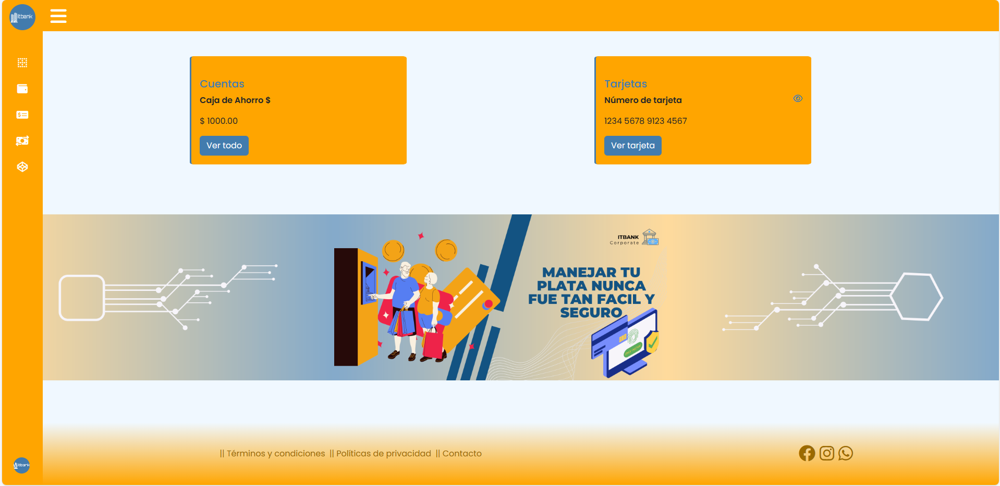
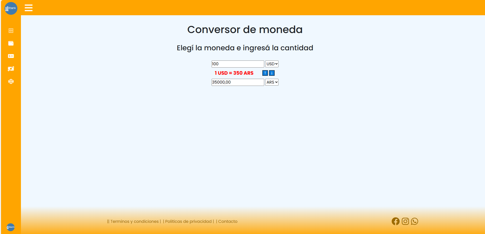
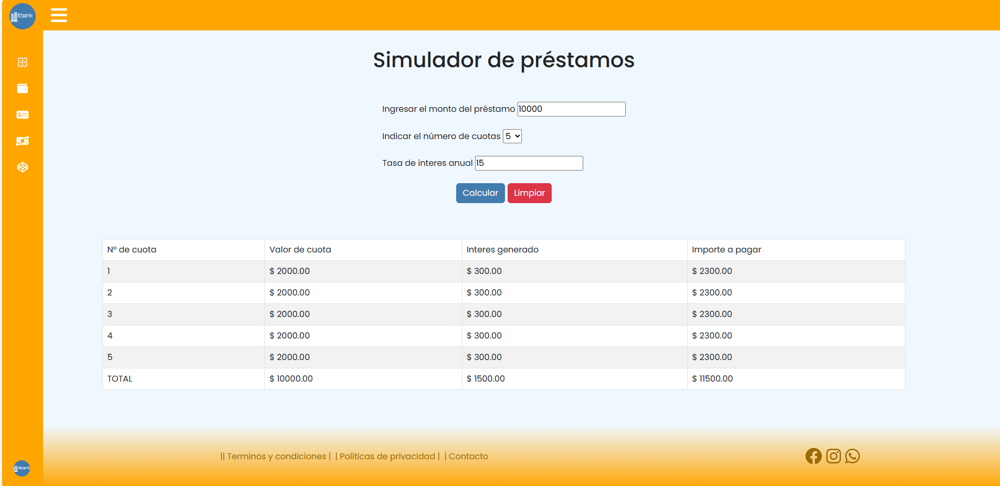
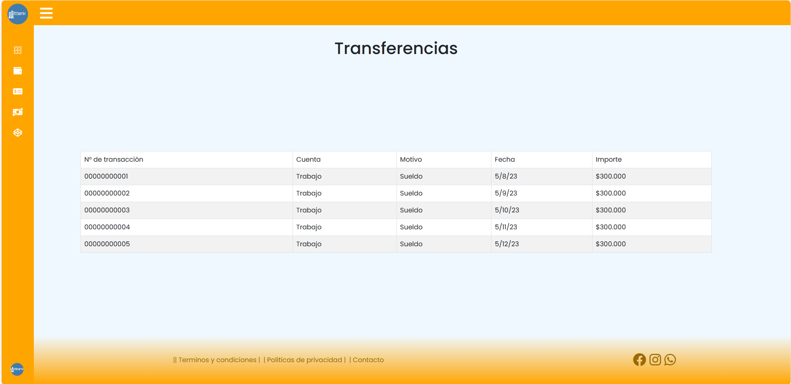
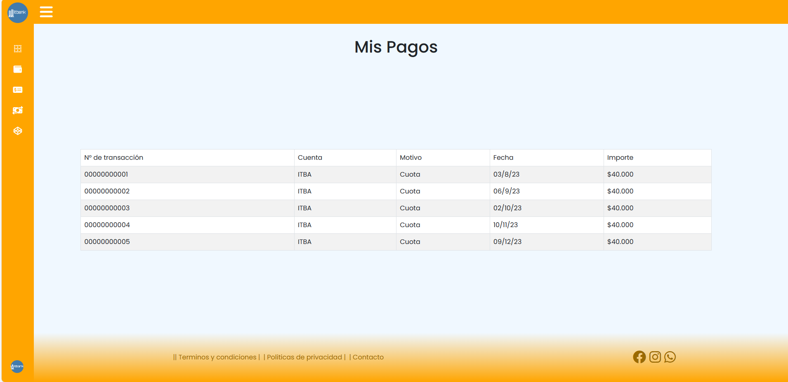

# IT Bank - Sprint N°1
---

## Preview
   

## Descripción del proyecto

Maqueta inicial de lo que será el nuevo homebanking de ITBANK, donde los usuarios podrán manejar sus cuentas y cajas de ahorro, realizar pagos y ver transferencias recibidas. Además de poder utilizar nuestro conversor de moneda y una calculadora para que los clientes puedan ver los intereses que le generarán sus préstamos.

## Características

Algunas de las características del proyecto:

*   Inicio de sesión y registro.
   
   

*   Conversor de moneda (Actualmente se puede convertir entre Pesos Argentinos, Dólares Estadounidenses y Euros).
   

*   Calculadora de préstamos.
   

*  Transferencias.
   

*  Pagos.
   

*   Imágenes y texto responsive.
 

## Tecnologías con las que se desarrolló el proyecto

*  HTML
*  CSS
*  JavaScript

### Código para resaltar (Calculadora de prestamos con JavaScript)

```function generarTabla() {
  document.getElementById("tabla").innerHTML = "";

  let montoIngresado = Number(document.getElementById("montoPrestamo").value);
  let cuotasIngresadas = Number(
    document.getElementById("cuotasPrestamo").value
  );
  let tasaInteres = Number(document.getElementById("interesPrestamo").value);
  if (montoIngresado > 0) {
    for (i = 1; i <= cuotasIngresadas; i++) {
      cantCuotas = montoIngresado / cuotasIngresadas;
      valorDeCuota = cantCuotas.toFixed(2);
      valorCuotas = (montoIngresado * tasaInteres) / 100 / cuotasIngresadas;
      interesGenerado = valorCuotas.toFixed(2);
      valorCuotaFinal = cantCuotas + valorCuotas;
      importeFinal = valorCuotaFinal.toFixed(2);
      document.getElementById("tabla").innerHTML =
        document.getElementById("tabla").innerHTML +
        `<tr>
            <td> ${i}</td>
            <td>$ ${valorDeCuota}</td>
            <td>$ ${interesGenerado}</td>
            <td>$ ${importeFinal}</td>
        </tr>`;
    }
    columna2 = montoIngresado.toFixed(2);
    totalInteres = valorCuotas * cuotasIngresadas;
    columna3 = totalInteres.toFixed(2);
    totalCuotaFinal = valorCuotaFinal * cuotasIngresadas;
    columna4 = totalCuotaFinal.toFixed(2);
    document.getElementById("total").innerHTML = "TOTAL";
    document.getElementById("col-1").innerHTML = `$ ${columna2}`;
    document.getElementById("col-2").innerHTML = `$ ${columna3}`;
    document.getElementById("col-3").innerHTML = `$ ${columna4}`;
  } else {
    alert("Falta ingresar un valor");
  }
}

// Limpiar el formulario y la tabla
function limpiarForm() {
  document.getElementById("formPrestamos").reset();
  document.getElementById("tabla").innerHTML = ``;
  document.getElementById("total").innerHTML = ``;
  document.getElementById("col-1").innerHTML = ``;
  document.getElementById("col-2").innerHTML = ``;
  document.getElementById("col-3").innerHTML = ``;
}
```


## Recursos utilizados

* Bootstrap
* Font Awesome
* API ExchangeRate

## Integrantes (Grupo 1)

* [Ana Jazmin Vazquez]("https://github.com/AJVazquez27")
* [Natalia Anahí Vizcarra Savino]("https://github.com/NeitRoot")
* [Juan Cruz Musi]("https://github.com/JuanMusi")
* [Jorge Caballero]("https://github.com/jorgecaballer0")
